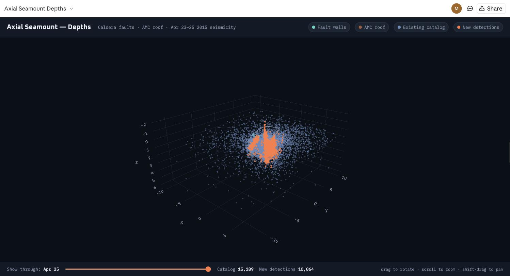

# Axial Seamount 3D — April 2015

Interactive 3D visualization of Axial Seamount's caldera-wall faults, the
axial magma chamber (AMC) roof, the caldera rim, and April 23–25, 2015
earthquake seismicity (existing catalog vs. new matched-filter detections),
in one rotatable scene with a day-by-day reveal slider.

**Live page**: https://maochuan-zhang-UW.github.io/axial_3d_2015/
(GitHub Pages serves `index.html` directly — open it in any browser)



## Credit

The **caldera-wall fault surfaces** (`data/I_fitting_WW_slices.mat` — west
wall point cloud, `data/East_Felix_06_Dis.mat` — east wall / Felix
structure) and the coordinate convention (origin at AXCC1, 45.9547°N /
130.0089°W, `latlon2xy_no_rotate`) are from
**[Maleen Kidiwela's `axial_visuals`](https://github.com/MaleenKidiwela/axial_visuals)**
repo, reused here with attribution. That project's own 3D view (built with
Plotly + a full earthquake catalog with a month-by-month slider) is at
https://maleenkidiwela.github.io/axial_3d.html — this page follows the
same overall approach, scoped to one 3-day window and a different dataset.

The **AMC roof** grid and **caldera rim** polygon originate with Arnulf et
al.'s seismic-reflection imaging and Bill Chadwick's rim digitization
respectively, both already in common use across the Axial Seamount research
group this project sits in (see `axial_calderaRim.m` in that same
`axial_visuals` repo, and the `Axial_background` data repo).

## What's plotted

- **West/east caldera walls** — point clouds from the credited data above
- **AMC roof** — a `Surface` trace, regridded from the Arnulf et al. reflector
  depth grid onto this page's local km frame
- **Caldera rim** — outline, drawn at the seafloor reference level
- **Existing catalog** vs. **new matched-filter detections** — from the
  [`TemplateMatching`](https://github.com/maochuan-zhang-UW) project's
  Axial Seamount template-matching pipeline, for 2015-04-23 to 2015-04-25
  (the 2015 Axial eruption)

Depth convention: km, positive down, throughout.

## Files

| File | Contents |
|------|----------|
| `index.html` | The published page — self-contained, Plotly loaded from cdnjs |
| `template.html` | Same page with `__DATA_JSON__` as a placeholder, for regenerating with new data |
| `prepare_3d_data.py` | Builds the data JSON spliced into `template.html`. **Not standalone** — imports `catalog_io`, `magma_chamber`, `plot_relocated` from the `TemplateMatching` project's `01-scripts/python/`, so it needs that project alongside this one to actually run |
| `data/*.mat` | The credited fault-wall point clouds (see above) |

## Regenerating

```bash
# from TemplateMatching/01-scripts/python, with prepare_3d_data.py copied there:
python prepare_3d_data.py \
  --west-wall ../../../axial_3d_2015/data/I_fitting_WW_slices.mat \
  --east-wall ../../../axial_3d_2015/data/East_Felix_06_Dis.mat \
  --relocated ../../02-data/catalogs/relocated_2015-04-23_t20.csv \
              ../../02-data/catalogs/relocated_2015-04-24_t20.csv \
              ../../02-data/catalogs/relocated_2015-04-25_t20.csv \
  --catalog-start 2015-04-23 --catalog-end 2015-04-26 \
  --out data_3d.json

python -c "
t = open('../../../axial_3d_2015/template.html').read()
d = open('data_3d.json').read()
open('../../../axial_3d_2015/index.html', 'w').write(t.replace('__DATA_JSON__', d))
"
```
